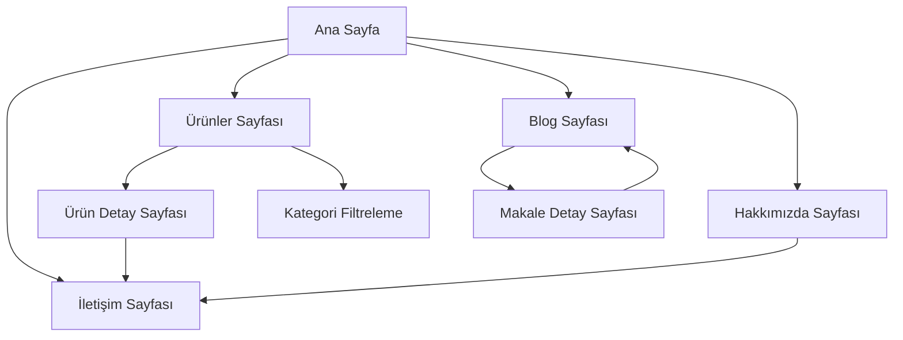

# Hüsnü Usta Mobilya - Ürün Gereksinim Belgesi (PRD)

## 1. Product Overview

Hüsnü Usta Mobilya, kaliteli ve şık mobilya çözümleri sunan bir marka olarak, müşterilerine yatak odası, salon ve mutfak mobilyalarında minimalist ve fonksiyonel tasarımlar sunmaktadır. <mcreference link="https://aimsaddergisi.com/mobilya-sektoru-2025te-surdurulebilir-uretim-dijital-donusum-ve-esnek-uretim-modellerine-yoneliyor/" index="5">5</mcreference> <mcreference link="https://www.ogretmenler.com.tr/blog/modern-mobilya-trendleri-2024/" index="4">4</mcreference>

Bu proje, Hüsnü Usta Mobilya'nın dijital varlığını güçlendirmek ve modern müşteri beklentilerini karşılamak amacıyla minimalist, şık ve kullanıcı dostu bir tanıtım sitesi geliştirmeyi hedeflemektedir. <mcreference link="https://wibisoft.com/2024-web-tasarim-trendleri/" index="1">1</mcreference>

Hedef pazar, kaliteli mobilya arayan, estetik ve fonksiyonelliği bir arada değerlendiren, dijital platformlarda araştırma yapan modern tüketicilerdir.

## 2. Core Features

### 2.1 User Roles

Bu projede kullanıcı rol ayrımı gerekmemektedir. Tüm ziyaretçiler aynı içeriğe erişebilir ve ürünleri inceleyebilir.

### 2.2 Feature Module

Hüsnü Usta Mobilya tanıtım sitesi aşağıdaki temel sayfalardan oluşmaktadır:

1. **Ana Sayfa**: hero section, marka tanıtımı, öne çıkan ürün kategorileri, müşteri referansları
2. **Ürünler Sayfası**: kategori filtreleme, ürün galerisi, detay görüntüleme, arama fonksiyonu
3. **Hakkımızda Sayfası**: şirket hikayesi, misyon-vizyon, kalite anlayışı, üretim süreci
4. **İletişim Sayfası**: iletişim formu, adres bilgileri, harita entegrasyonu, sosyal medya linkleri
5. **Blog/İçerik Sayfası**: mobilya bakım ipuçları, dekorasyon önerileri, trend haberleri

### 2.3 Page Details

| Page Name | Module Name | Feature description |
|-----------|-------------|---------------------|
| Ana Sayfa | Hero Section | Marka mesajını vurgulayan büyük görsel, call-to-action butonları, animasyonlu geçişler |
| Ana Sayfa | Öne Çıkan Kategoriler | Yatak odası, salon, mutfak kategorilerini grid düzeninde gösterme |
| Ana Sayfa | Müşteri Referansları | Müşteri yorumları ve değerlendirmeleri carousel formatında |
| Ürünler Sayfası | Kategori Filtreleme | Yatak odası, salon, mutfak, genç odası filtrelerini uygulama |
| Ürünler Sayfası | Ürün Galerisi | Grid tabanlı ürün listesi, hover efektleri, lazy loading |
| Ürünler Sayfası | Ürün Detayı | Modal veya ayrı sayfa ile ürün detaylarını gösterme |
| Hakkımızda Sayfası | Şirket Hikayesi | Marka geçmişi, değerler, kalite anlayışını anlatma |
| Hakkımızda Sayfası | Üretim Süreci | Kaliteli üretim sürecini görsellerle açıklama |
| İletişim Sayfası | İletişim Formu | Ad, email, telefon, mesaj alanları ile form validasyonu |
| İletişim Sayfası | Konum Bilgileri | Adres, telefon, email bilgileri ve harita entegrasyonu |
| Blog Sayfası | İçerik Listesi | Mobilya bakımı, dekorasyon ipuçları, trend makaleleri |
| Blog Sayfası | Makale Detayı | Tam metin okuma, sosyal medya paylaşım butonları |

## 3. Core Process

**Ana Kullanıcı Akışı:**
Kullanıcı siteye giriş yapar → Ana sayfada marka ve ürünleri keşfeder → Ürünler sayfasında kategori filtrelerini kullanarak aradığı mobilyaları bulur → Ürün detaylarını inceler → İletişim formu üzerinden bilgi talep eder veya telefon ile iletişime geçer → Blog bölümünden mobilya ve dekorasyon hakkında bilgi edinir.

**Sayfa Navigasyon Akış Şeması:**

## 4. User Interface Design

### 4.1 Design Style

**Renk Paleti:** <mcreference link="https://wibisoft.com/2024-web-tasarim-trendleri/" index="1">1</mcreference>
- Primary: Koyu kahverengi (#2D1810) - ahşap ve doğallığı temsil eden
- Secondary: Krem beyazı (#F8F6F0) - temizlik ve minimalizmi vurgulayan
- Accent: Altın sarısı (#D4AF37) - premium kaliteyi simgeleyen
- Text: Koyu gri (#333333) - okunabilirlik için

**Buton Stili:** <mcreference link="https://yonkasoft.com/2024-web-tasarim-trendleri/" index="2">2</mcreference>
- Yumuşak köşeli (border-radius: 8px)
- Hover efektleri ile interaktif
- Gradient geçişler premium hissi için

**Tipografi:**
- Başlıklar: Playfair Display (serif, elegant)
- Gövde metni: Inter (sans-serif, modern ve okunabilir)
- Font boyutları: H1: 48px, H2: 36px, H3: 24px, Body: 16px

**Layout Stili:** <mcreference link="https://bayraknet.com.tr/kucuk-isletmeler-icin-minimalist-web-tasarim-rehberi/" index="1">1</mcreference>
- Grid tabanlı düzen
- Bol beyaz alan kullanımı
- Kartlı tasarım (card-based)
- Sticky navigation

**İkon ve Emoji Stili:**
- Minimalist line icons
- Mobilya ile ilgili simgeler (🪑, 🛏️, 🏠)
- Sosyal medya ikonları outline style

### 4.2 Page Design Overview

| Page Name | Module Name | UI Elements |
|-----------|-------------|-------------|
| Ana Sayfa | Hero Section | Full-screen background image, overlay gradient, centered text, CTA button with hover animation |
| Ana Sayfa | Kategori Grid | 3-column grid layout, hover scale effect, category icons, subtle shadows |
| Ürünler Sayfası | Filter Bar | Horizontal filter chips, active state styling, clear all option |
| Ürünler Sayfası | Product Grid | Responsive grid (4-3-2-1 columns), image lazy loading, price tags, quick view buttons |
| Hakkımızda Sayfası | Story Section | Split layout with text and images, timeline component, parallax scrolling |
| İletişim Sayfası | Contact Form | Clean form design, floating labels, validation states, submit button animation |
| Blog Sayfası | Article Cards | Card layout with featured images, excerpt text, read more buttons, category tags |

### 4.3 Responsiveness

**Tasarım Yaklaşımı:** Mobile-first responsive design <mcreference link="https://yonkasoft.com/2024-web-tasarim-trendleri/" index="2">2</mcreference>

**Breakpoints:**
- Mobile: 320px - 768px
- Tablet: 768px - 1024px  
- Desktop: 1024px+

**Touch Optimization:**
- Minimum 44px touch targets
- Swipe gestures for product galleries
- Touch-friendly navigation menu
- Optimized form inputs for mobile keyboards

**Performance Considerations:**
- Lazy loading for images
- Progressive image loading
- Compressed assets for mobile
- Reduced animations on mobile for better performance