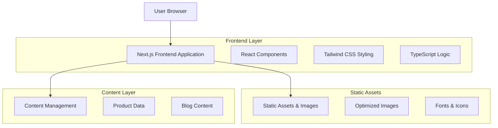
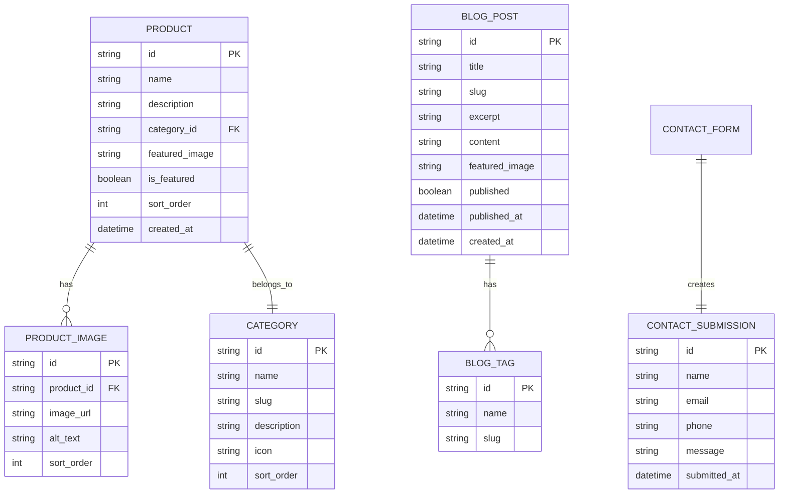

# Hüsnü Usta Mobilya - Teknik Mimari Belgesi

## 1. Architecture Design



## 2. Technology Description

- **Frontend:** Next.js 14 + React 18 + TypeScript 5 + Tailwind CSS 3
- **Build Tool:** Vite (Next.js built-in)
- **Image Optimization:** Next.js Image component
- **Icons:** Lucide React icons
- **Animations:** Framer Motion
- **Forms:** React Hook Form + Zod validation
- **Backend:** Static site (no backend required)

## 3. Route Definitions

| Route | Purpose |
|-------|---------|
| / | Ana sayfa, hero section ve öne çıkan kategorileri gösterir |
| /urunler | Ürün galerisi sayfası, filtreleme ve arama fonksiyonları |
| /urunler/[kategori] | Kategori bazlı ürün listesi (yatak-odasi, salon, mutfak) |
| /urunler/[kategori]/[urun] | Ürün detay sayfası |
| /hakkimizda | Şirket hikayesi, misyon-vizyon ve kalite anlayışı |
| /iletisim | İletişim formu, adres bilgileri ve harita |
| /blog | Blog ana sayfası, makale listesi |
| /blog/[slug] | Blog makale detay sayfası |

## 4. Component Architecture

### 4.1 Atomic Design Structure

**Atoms (Temel Bileşenler):**
```typescript
// Button Component
interface ButtonProps {
  variant: 'primary' | 'secondary' | 'outline';
  size: 'sm' | 'md' | 'lg';
  children: React.ReactNode;
  onClick?: () => void;
}

// Input Component
interface InputProps {
  type: 'text' | 'email' | 'tel' | 'textarea';
  placeholder: string;
  value: string;
  onChange: (value: string) => void;
  error?: string;
}
```

**Molecules (Bileşik Bileşenler):**
```typescript
// ProductCard Component
interface ProductCardProps {
  product: {
    id: string;
    name: string;
    category: string;
    image: string;
    price?: string;
  };
  onQuickView: (id: string) => void;
}

// FilterChip Component
interface FilterChipProps {
  label: string;
  active: boolean;
  onClick: () => void;
}
```

**Organisms (Karmaşık Bileşenler):**
```typescript
// ProductGrid Component
interface ProductGridProps {
  products: Product[];
  filters: FilterState;
  onFilterChange: (filters: FilterState) => void;
}

// ContactForm Component
interface ContactFormProps {
  onSubmit: (data: ContactFormData) => void;
  loading?: boolean;
}
```

### 4.2 Theme System

```typescript
// Theme Configuration
interface ThemeConfig {
  colors: {
    primary: string;
    secondary: string;
    accent: string;
    background: {
      light: string;
      dark: string;
    };
    text: {
      light: string;
      dark: string;
    };
  };
  fonts: {
    heading: string;
    body: string;
  };
  spacing: Record<string, string>;
  breakpoints: Record<string, string>;
}
```

## 5. Data Model

### 5.1 Data Model Definition



### 5.2 Data Definition Language

**Product Data Structure (JSON):**
```json
{
  "products": [
    {
      "id": "yatak-odasi-takimi-1",
      "name": "Modern Yatak Odası Takımı",
      "description": "Minimalist tasarım anlayışıyla üretilen modern yatak odası takımı",
      "category": "yatak-odasi",
      "featured_image": "/images/products/yatak-odasi-1.jpg",
      "images": [
        "/images/products/yatak-odasi-1-1.jpg",
        "/images/products/yatak-odasi-1-2.jpg"
      ],
      "is_featured": true,
      "specifications": {
        "material": "18mm MDF",
        "color": "Ceviz",
        "dimensions": "160x200 cm"
      }
    }
  ],
  "categories": [
    {
      "id": "yatak-odasi",
      "name": "Yatak Odası",
      "slug": "yatak-odasi",
      "description": "Modern ve klasik yatak odası takımları",
      "icon": "bed",
      "sort_order": 1
    }
  ]
}
```

**Blog Content Structure (Markdown + Frontmatter):**
```markdown
---
title: "2024 Mobilya Trendleri"
slug: "2024-mobilya-trendleri"
excerpt: "Bu yılın en popüler mobilya tasarım trendlerini keşfedin"
featured_image: "/images/blog/2024-trends.jpg"
tags: ["trendler", "tasarım", "mobilya"]
published: true
published_at: "2024-01-15"
---

# 2024 Mobilya Trendleri

Bu yıl mobilya dünyasında minimalizm ve sürdürülebilirlik ön planda...
```

## 6. Performance Optimization

### 6.1 Image Optimization
- Next.js Image component ile otomatik optimizasyon
- WebP format desteği
- Lazy loading implementation
- Responsive images (srcset)

### 6.2 Code Splitting
- Route-based code splitting
- Dynamic imports for heavy components
- Bundle analyzer ile optimizasyon

### 6.3 SEO Optimization
```typescript
// SEO Configuration
interface SEOConfig {
  title: string;
  description: string;
  keywords: string[];
  openGraph: {
    title: string;
    description: string;
    image: string;
    url: string;
  };
  structuredData: Record<string, any>;
}
```

## 7. Deployment Configuration

### 7.1 Build Configuration
```javascript
// next.config.js
/** @type {import('next').NextConfig} */
const nextConfig = {
  output: 'export',
  trailingSlash: true,
  images: {
    unoptimized: true
  },
  experimental: {
    optimizeCss: true
  }
}

module.exports = nextConfig
```

### 7.2 Environment Variables
```bash
# .env.local
NEXT_PUBLIC_SITE_URL=https://husnuustamobilya.com
NEXT_PUBLIC_CONTACT_EMAIL=info@husnuustamobilya.com
NEXT_PUBLIC_GOOGLE_MAPS_API_KEY=your_api_key_here
```

### 7.3 Deployment Targets
- **Vercel:** Recommended for optimal Next.js performance
- **Netlify:** Alternative static hosting
- **GitHub Pages:** Budget-friendly option
- **Traditional Hosting:** Export as static files

## 8. Development Workflow

### 8.1 Project Structure
```
husnu-usta-mobilya/
├── src/
│   ├── components/
│   │   ├── atoms/
│   │   ├── molecules/
│   │   └── organisms/
│   ├── pages/
│   ├── styles/
│   ├── data/
│   ├── types/
│   └── utils/
├── public/
│   ├── images/
│   └── icons/
├── docs/
└── config files
```

### 8.2 Development Scripts
```json
{
  "scripts": {
    "dev": "next dev",
    "build": "next build",
    "start": "next start",
    "lint": "next lint",
    "type-check": "tsc --noEmit",
    "export": "next build && next export"
  }
}
```